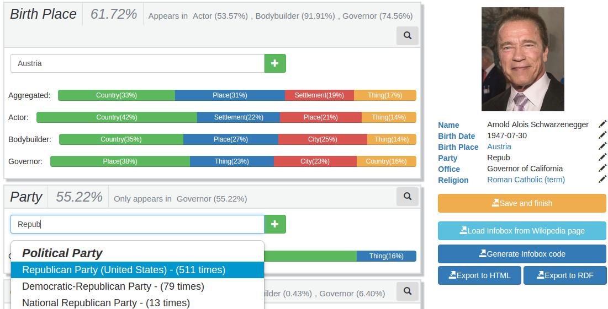

# Infoboxer
This repository contains the source code of my Final Degree Project (TFG), Degree of Computer Engineering, University of Zaragoza. Please check the file [tfg_report.pdf](tfg_report.pdf), which contains the full report of my project, for more information.

## Description

Wikipedia infoboxes summarize the most important information of a Wikipedia page. In addition to being useful for Wikipedia readers, knowledge bases like DBpedia and Google Knowledge Graph can easily process and use their semi-structured content. However, the current mechanisms for creating or extending infoboxes are difficult and complex for editors to use. The result is fewer Wikipedia pages with infoboxes and more errors, inaccuracies, and deficiencies in existing infoboxes. 

This project  helps users to create rich and accurate Wikipedia infoboxes. The system uses statistical and semantic knowledge from linked data sources to simplify the process of creating and extending infobox content. It constructs semantic infobox templates by suggesting common attributes and their values from similar articles and controlling the expected values semantically. We present the implemented prototype and experiments with users that evaluate both the quality of the new infobox content and the users' subjective experience.

Please visit the [Project webpage](http://sid.cps.unizar.es/Infoboxer) for more information, videos and publications.

##Used technologies
* AngularJS
* Bootstrap
* Spring Framework
* OWLAPI
* HermiT
* Jena Fuseki
* NPM
* MySQL

##User and technical manuals
* **User manual**: pages 105 to 111 of the report.
* **How to run the project**: pages 61 to 66 of the report.
* **Configuration files**: pages 67 to 71 of the report.
* **How to load different Knowledge Bases**: pages 71 to 83  of the report.
* **Exposed HTTP API**: pages 84 to 88  of the report.
